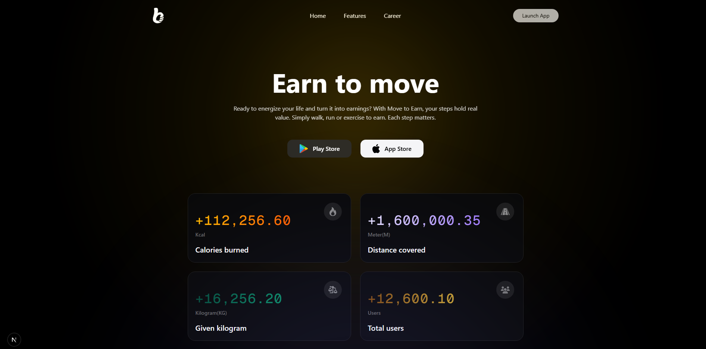
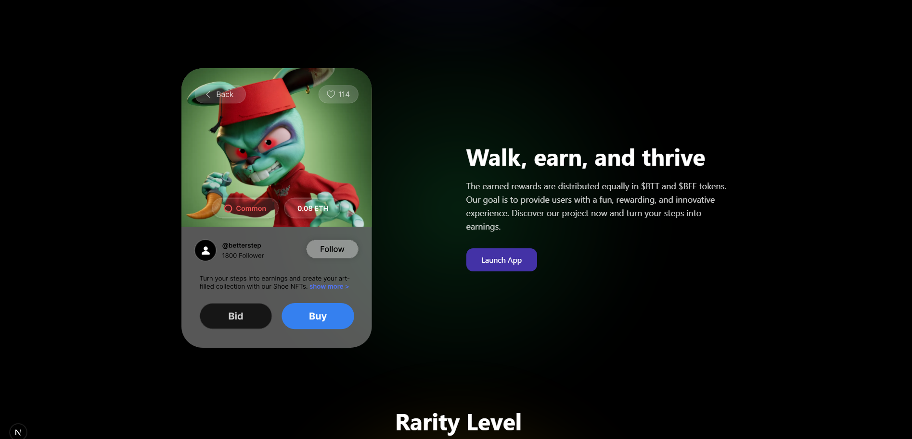
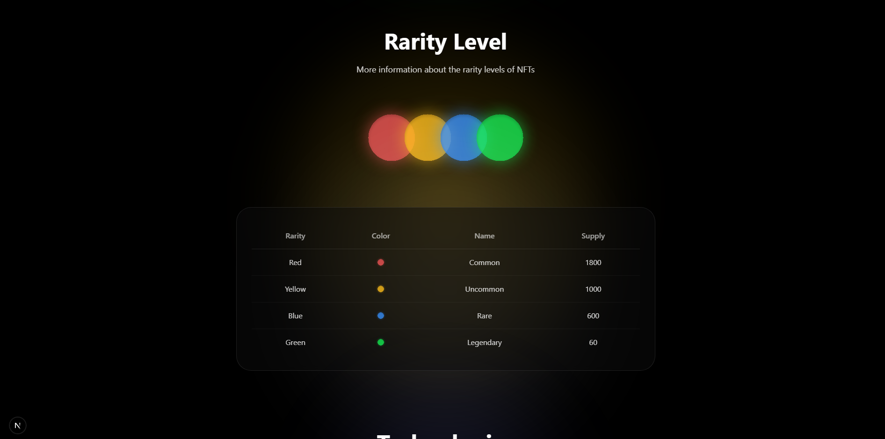

# Next.js Cryptocurrency Landing Page



A modern, responsive cryptocurrency landing page built with Next.js. This project showcases a sleek design for a cryptocurrency platform with a focus on user experience and performance.

## 🌟 Features

- Modern and responsive design
- Built with Next.js 14
- Styled with Tailwind CSS
- Optimized performance
- Mobile-first approach

## 🚀 Live Demo

Visit the live demo at: [https://nextjs-cryptocurrency-landing.vercel.app](https://nextjs-cryptocurrency-landing.vercel.app)

## 📸 Screenshots




## 🛠️ Technologies

- [Next.js](https://nextjs.org/)
- [React](https://reactjs.org/)
- [Tailwind CSS](https://tailwindcss.com/)
- [TypeScript](https://www.typescriptlang.org/)

## 🚦 Getting Started

1. Clone the repository:
```bash
git clone https://github.com/anibalalpizar/nextjs-cryptocurrency-landing.git
```

2. Install dependencies:
```bash
npm install
# or
yarn install
# or
pnpm install
```

3. Run the development server:
```bash
npm run dev
# or
yarn dev
# or
pnpm dev
```

4. Open [http://localhost:3000](http://localhost:3000) with your browser to see the result.

## 📝 Credits

- Design: [Cryptocurrency Landing Page - Community](https://www.figma.com/design/l7pvxIsvQzHfkRFemrzpg5/Cryptocurrency-Landing-Page--Community-?node-id=308-193&p=f&t=LbS66DJKftZtr65D-0)
- Icons: Various SVG icons from the public directory
- Font: [Geist](https://vercel.com/font) by Vercel

## 📄 License

This project is open source and available under the [MIT License](LICENSE).

## 🤝 Contributing

Contributions, issues, and feature requests are welcome! Feel free to check the [issues page](https://github.com/anibalalpizar/nextjs-cryptocurrency-landing/issues).

## 👤 Author

**Anibal Alpizar**
- GitHub: [@anibalalpizar](https://github.com/anibalalpizar)

---

Built with ❤️ using Next.js
